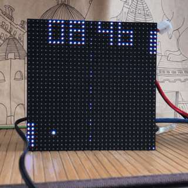
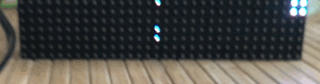

pong clock made using the adafruit controller and a 32x32 rgb led matrix

Auto-Playing pong clock where the score is the current time.
With a custom font to match the orignal Pong game

The Seconds are indicating by a sweeping progress bar to stop any flashing and still give you an indication of how far the seconds are.

